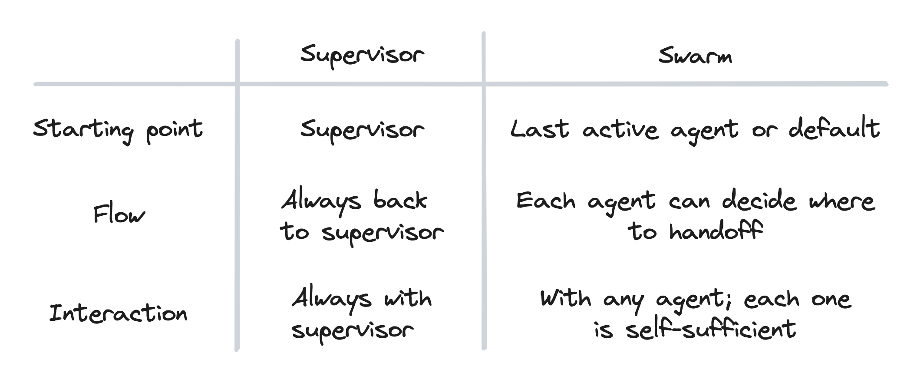

# Multi-Agent Chatbot Examples

This repository demonstrates two coordination patterns for LLM-based agents using **LangGraph Supervisor** and **LangGraph Swarm** architectures. Under `src/`, you’ll find three example workflows:

* **`agent/`**
  A **voice-enabled customer support** bot implemented in the **Swarm** style by default (but easily switchable to Supervisor).
* **`doc-agent/`**
  An **appointment scheduler** built on the **Supervisor** architecture.
* **`bookings-template/`**
  A **booking workflow** sketch in the **Swarm** architecture.

---

## Table of Contents

1. [Architecture Overview](#architecture-overview)
2. [Quick Start](#quick-start)
3. [Example Workflows](#example-workflows)

   * [Customer Agent (Swarm / Supervisor)](#customer-agent-swarm--supervisor)
   * [Doctor-Scheduler Agent (Supervisor)](#doctor-scheduler-agent-supervisor)
   * [Bookings Template (Swarm)](#bookings-template-swarm)
4. [Voice-Enabled Customer Agent](#voice-enabled-customer-agent)
5. [License](#license)

---

## Architecture Overview

### Supervisor

A single **supervisor** node manages routing to specialized child agents. The workflow always returns control to the supervisor, which decides the next agent or termination step.


### Swarm

Each agent can hand off directly to any other agent in the group, without a central supervisor. The last active agent drives the next step.


## 🔍 Use Cases by Pattern

### Supervisor

A central **supervisor** orchestrates all hand-offs and returns control after each step.


| **Use Case**                            | **Description**                                                                                                       |
| --------------------------------------- | --------------------------------------------------------------------------------------------------------------------- |
| **Hierarchical Q\&A**                   | A Supervisor routes between a General Q\&A agent, a Resume-Parser agent, and a Web-Search agent ([DEV Community][1]). |
| **Doctor Appointment Scheduler**        | Orchestrates `information_agent` (availability lookup) and `booking_agent` (set/cancel/reschedule) ([Medium][2]).     |
| **Automated Bug-Fixing Pipeline**       | Supervisor drives an Agent-Debugger, an LLM Code-Generator, and a Test-Runner agent in sequence ([arXiv][3]).         |
| **Real-Time Data Analysis & Sentiment** | Spark-Streaming → Sentiment-Agent → Escalation-Agent with human-in-the-loop via Supervisor ([arXiv][4]).              |
| **Modular Machine Translation**         | Supervisor orchestrates English, French, Japanese translation agents for a unified MT service ([arXiv][5]).           |

---

### Swarm

**Swarm** agents hand off directly, peer-to-peer, in a shared workspace.


| **Use Case**                          | **Description**                                                                                                                           |
| ------------------------------------- | ----------------------------------------------------------------------------------------------------------------------------------------- |
| **Multi-domain QA & Translation**     | General QA ↔ Science ↔ Translation agents collaborate dynamically without a central router ([DEV Community][6]).                          |
| **Travel Booking (Flight ↔ Hotel)**   | Flight agent books a ticket then seamlessly hands off “book hotel” to a Hotel agent ([Medium][7]).                                        |
| **Emergency Travel Coordinator**      | Triage by EmergencyCoordinator → MedicalEvacuation / Security / Disaster-Response agents ([Medium][8]).                                   |
| **Ensemble Code Review**              | Coder agent writes code → Checker agent reviews and suggests fixes → Coder re-runs fixes ([Artificial Intelligence in Plain English][9]). |
| **Customer Support (Flight & Hotel)** | Flight & Hotel assistants share context in real-time for integrated travel support ([Toolify][10]).                                       |




---

## Quick Start

1. **Install & configure**

   ```bash
   python3.11 -m venv venv
   source venv/bin/activate
   pip install -e .[inmem] langgraph-cli
   ```

2. **Configure your secrets**
   Create a .env file at the project root and add your API keys:

   ```bash
   OPENAI_API_KEY=sk-...
   AZURE_OPENAI_API_KEY=...
   LANGCHAIN_API_KEY=...
   ```

3. **Main config**
   Each workflow reads its routing, agents, and tool definitions from langgraph.json at the root—open it to tweak agent names, prompts, or turn on/off streaming.

4. **Launch LangGraph Dev Studio**

   ```bash
   uvx --refresh \
       --from "langgraph-cli[inmem]" \
       --with-editable . \
       langgraph dev
   ```

   * In Dev Studio you can select any of the three workflows under `src/` and test them interactively.
   * For voice-enabled testing, upload pre-recorded WAVs to the `transcribe_audio` tool, inspect the JSON TTS output, and download/play it locally.

---

## Example Workflows

### Customer Agent (Swarm ↔ Supervisor)

* **Directory**: `src/agent/`
* **Pattern**: By default, demonstrates the **Swarm** handoff between:

  1. **`disambiguation_agent`** (figures out intent)
  2. **`service_agent`** (executes or transfers)
* **Switching**: Change `create_swarm(...)` vs `create_supervisor(...)` in `graph.py` to toggle architectures.

### Doctor-Scheduler Agent (Supervisor)

* **Directory**: `src/doc-agent/`
* **Pattern**: A **Supervisor** routes between:

  1. **`information_agent`** (checks availability)
  2. **`booking_agent`** (sets, cancels, reschedules appointments)

### Bookings Template (Swarm)

* **Directory**: `src/bookings-template/`
* **Pattern**: A minimal **Swarm** example showing tool-calling between flight, hotel, and car-rental agents.

---

## Voice-Enabled Customer Agent

The **Customer Agent** in `src/agent/graph.py` can run locally as a full **voice chatbot**:

1. **Dependencies**

   ```bash
   pip install sounddevice scipy simpleaudio pydub ffmpeg-python
   brew install ffmpeg
   ```

2. **Run**

   ```bash
   python src/agent/graph.py
   ```

   * The script records from your microphone,
   * uses Whisper for STT,
   * invokes the multi-agent workflow,
   * synthesizes the reply with TTS,
   * plays it back—all in a loop until you say “bye.”

3. **Dev Studio Voice Testing**

   * Pre-record a series of WAV files (e.g. `turn1.wav`, `turn2.wav`, …).
   * In Dev Studio, use the **File** uploader on the `transcribe_audio` tool.
   * Examine the JSON with `"tts_base64"` and decode/play locally.

---

## License

MIT © Paresh Raut 


[1]: https://dev.to/sreeni5018/building-multi-agent-systems-with-langgraph-supervisor-138i?utm_source=chatgpt.com "Building Multi-Agent Systems with LangGraph-Supervisor"
[2]: https://medium.com/%40anuragmishra_27746/building-multi-agents-supervisor-system-from-scratch-with-langgraph-langsmith-b602e8c2c95d?utm_source=chatgpt.com "Building Multi-Agents Supervisor System from Scratch with ... - Medium"
[3]: https://arxiv.org/abs/2502.18465?utm_source=chatgpt.com "Empirical Research on Utilizing LLM-based Agents for Automated Bug Fixing via LangGraph"
[4]: https://arxiv.org/abs/2501.14734?utm_source=chatgpt.com "Research on the Application of Spark Streaming Real-Time Data Analysis System and large language model Intelligent Agents"
[5]: https://arxiv.org/abs/2412.03801?utm_source=chatgpt.com "Agent AI with LangGraph: A Modular Framework for Enhancing Machine Translation Using Large Language Models"
[6]: https://dev.to/sreeni5018/building-multi-agent-systems-with-langgraph-swarm-a-new-approach-to-agent-collaboration-15kj "Building Multi-Agent Systems with LangGraph Swarm: A New Approach to Agent Collaboration - DEV Community"
[7]: https://medium.com/%40jalajagr/how-langgraph-swarm-enhances-ai-powered-flight-and-hotel-reservations-a-step-by-step-g-76eb4beb4df4?utm_source=chatgpt.com "How LangGraph Swarm Agent Enhances Flight and Hotel ... - Medium"
[8]: https://medium.com/%40prxshetty/how-i-built-a-swarm-of-ai-agents-with-langchain-2e0916ce0d38?utm_source=chatgpt.com "How I built a Swarm of AI Agents with LangChain - Medium"
[9]: https://ai.plainenglish.io/technical-comparison-of-autogen-crewai-langgraph-and-openai-swarm-1e4e9571d725?utm_source=chatgpt.com "Technical Comparison of AutoGen, CrewAI, LangGraph, and ..."
[10]: https://www.toolify.ai/ai-news/mastering-multiagent-systems-the-power-of-agent-swarm-architecture-3432172?utm_source=chatgpt.com "Mastering Multi-Agent Systems: The Power of Agent Swarm ..."